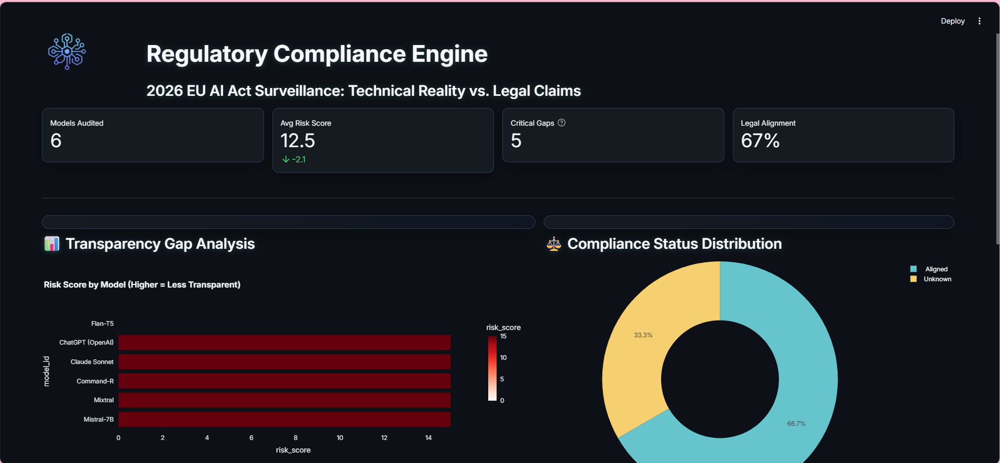
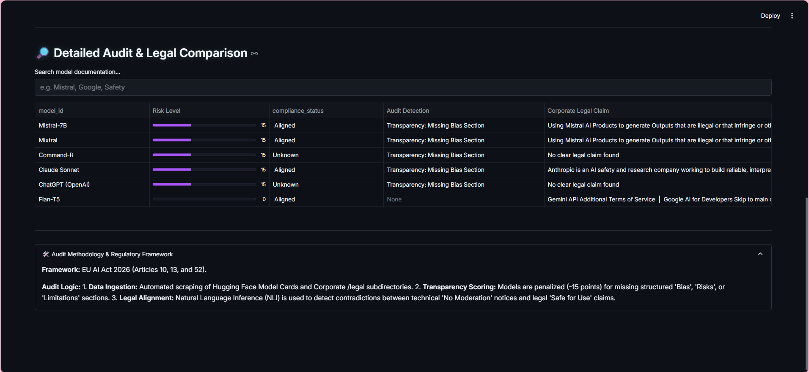

# 🛡️ Guardia AI 
### EU AI Act Regulatory Surveillance & Compliance Pipeline


## 📖 Overview
In **2026**, the **EU AI Act** enforces strict transparency requirements (**Articles 13 & 52**) for General Purpose AI models. Non-compliance can result in fines up to **7% of global turnover**.

**Guardia AI** is an automated RegTech pipeline that monitors the **"Compliance Drift"** between a model’s technical reality and its corporate legal promises. It identifies gaps where technical documentation (Hugging Face Model Cards) fails to provide the structured risk and bias disclosures promised in legal terms of service.




---

## 🚀 Key Features
* **Automated Technical Auditing:** Scrapes and parses YAML metadata and documentation from the Hugging Face Hub to verify transparency.
* **Legal Alignment Engine:** Cross-references technical specs with corporate/legal pages to detect contradictions.
* **NLP-Driven Risk Scoring:** Quantifies compliance risk based on the presence of structured Bias, Risk, and Limitation sections.
* **Executive Dashboard:** A high-fidelity Streamlit interface for real-time surveillance of the AI model ecosystem.

---

## 🏗️ Pipeline Architecture
1.  **Ingestion:** Parallel scrapers pull data from technical repos and corporate legal sites.
2.  **Transformation:** Messy JSON/HTML is flattened into a structured "Data Lake."
3.  **Audit Logic:** An NLP gate checks for compliance markers (e.g., "Article 13" transparency flags).
4.  **Reporting:** Data is pushed to `audit_report.csv` and visualized in the dashboard.

---

## 🛠️ Technical Stack

| Category | Tools |
| :--- | :--- |
| **Core** | Python 3.10+ |
| **Data Ingestion** | `huggingface_hub`, `Playwright` |
| **Data Processing** | `Pandas`, `Pydantic` |
| **Analysis** | NLP (Semantic Mapping, Keyword Density) |
| **Visualization** | `Streamlit`, `Plotly` |

---

## 📊 Sample Insights
*Based on a recent audit of 6 major models:*

* **Flan-T5 (Google):** `0 Risk Score` — Features structured "Ethical Considerations" and "Environmental Impact" sections.
* **Mistral-7B:** `15 Risk Score` — Lacks a structured "Bias" section, relying on buried "Notice" disclaimers.
* **Compliance Drift:** Currently, **33%** of audited models have an "Unknown" status due to a lack of clear legal claims.

---

## ⚙️ Installation & Deployment

### 1. Clone the repo
```bash
git clone https://github.com/laila-kz/Regulatory-Compliance-Engine

```

# 🛡️ Guardia AI
### EU AI Act Regulatory Surveillance & Compliance Pipeline

🔗 **[Live Dashboard](https://laila-kz-regulatory-compliance-engine-srcapp-usbfnx.streamlit.app/)**
